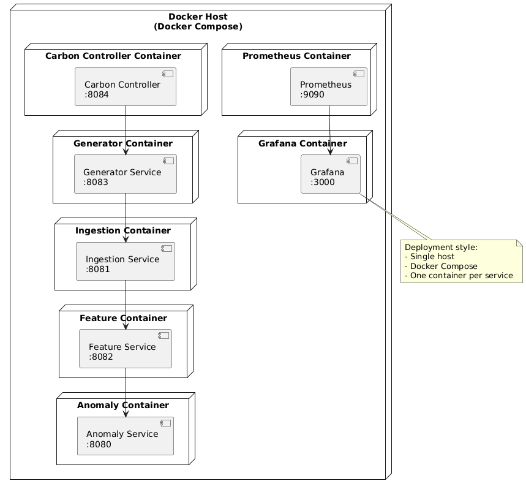
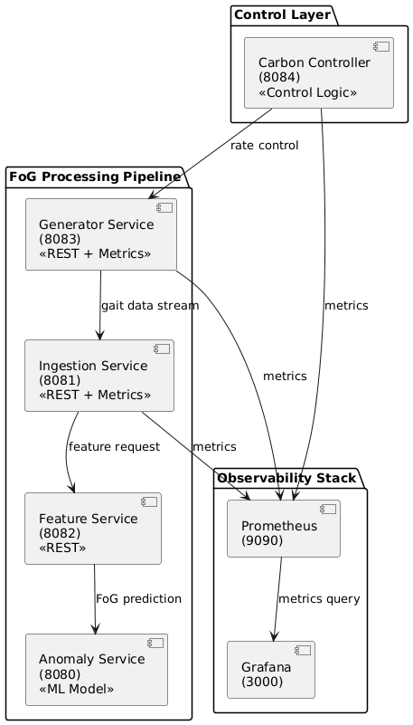
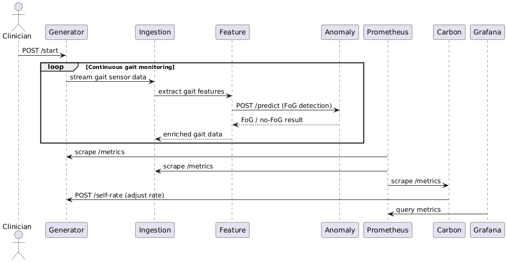

# FoG Prediction Platform – Architecture Documentation

This document describes the architecture of the **Freezing of Gait (FoG) Prediction Platform**.  
The system is built using a **microservice architecture**, deployed via **Docker Compose**, and enhanced with **carbon-aware control** and **observability**.

Its purpose is to continuously generate gait sensor data, process it through a feature extraction and machine learning pipeline, detect FoG events, and dynamically adjust data generation rates to reduce energy consumption while preserving diagnostic accuracy.

---

## Overview

The platform consists of the following key subsystems:

- **Data Generation & Processing Pipeline**
- **Machine Learning–based FoG Detection**
- **Carbon-Aware Control Layer**
- **Observability Stack (Prometheus & Grafana)**

Each subsystem is represented using UML diagrams to clearly show responsibilities, interactions, and deployment structure.

---

## Deployment Diagram

The deployment diagram shows **where each service runs** and **how services are deployed using Docker Compose** on a single host.

### Explanation
- All services run on a **single Docker host**.
- Each microservice is deployed as **one container per service**.
- Internal service communication uses Docker’s internal DNS.
- Exposed ports allow access to APIs and dashboards.

### Key Services
- **Carbon Controller (8084)** – Adjusts generator rate based on system state.
- **Generator (8083)** – Produces gait sensor data.
- **Ingestion (8081)** – Buffers incoming sensor data.
- **Feature Service (8082)** – Extracts normalized gait features.
- **Anomaly Service (8080)** – ML-based FoG detection.
- **Prometheus (9090)** – Collects metrics.
- **Grafana (3000)** – Visualizes metrics.

---

## Component Diagram

The component diagram illustrates the **logical structure of the system**, grouped by responsibility.

### Explanation
- **Control Layer**
  - Carbon Controller applies control logic to adjust data generation rate.
- **FoG Processing Pipeline**
  - Generator → Ingestion → Feature → Anomaly
  - Data flows sequentially through the pipeline.
- **Observability Stack**
  - Prometheus scrapes metrics from all services.
  - Grafana queries Prometheus to visualize metrics.

### Why this matters
This diagram makes it clear:
- Which components depend on each other
- Where control feedback loops exist
- How observability is decoupled from core logic

---

## Sequence Diagram

The sequence diagram shows **runtime interactions** during continuous gait monitoring.

### Explanation
1. **Clinician** starts data collection.
2. **Generator** streams gait sensor data.
3. **Ingestion** buffers incoming data.
4. **Feature Service** extracts gait features.
5. **Anomaly Service** predicts FoG / no-FoG.
6. **Prometheus** scrapes metrics from services.
7. **Carbon Controller** adjusts generator rate.
8. **Grafana** queries metrics for visualization.

### Key Characteristics
- Continuous loop for real-time monitoring
- Clear separation of concerns
- Carbon-aware feedback loop is explicit

---

## Use Case Diagram

The use case diagram captures **system functionality from a user and system perspective**.

### Actors
- **Clinician** – Operates and controls the system.
- **Prometheus** – Collects system metrics.
- **Grafana** – Visualizes metrics.

### Main Use Cases
- **UC1: Start Data Collection**
- **UC2: Detect FoG Events**
- **UC3: Expose System Metrics**
- **UC4: Adjust Data Generation Rate**
- **UC5: Optimize Energy Usage**
- **NS1: Visualize Metrics**

### Architecturally Significant Notes
- Defines the need for:
  - Generator and ingestion services
  - ML-based anomaly detection
  - Feedback control loop
  - Prometheus instrumentation

---

## Design Rationale

- **Microservices** improve modularity and scalability
- **REST APIs** simplify service communication
- **Docker Compose** enables reproducible deployment
- **Prometheus + Grafana** provide transparent observability
- **Carbon Controller** introduces sustainability-aware system behavior

---

## Summary

These UML diagrams together provide a **complete architectural view** of the FoG Prediction Platform:

| Diagram Type | Purpose |
|-------------|--------|
| Deployment | Where the system runs |
| Component | How the system is structured |
| Sequence | How the system behaves at runtime |
| Use Case | What the system does and why |

This documentation ensures the architecture is **clear, consistent, and aligned with the actual implementation**.

---
