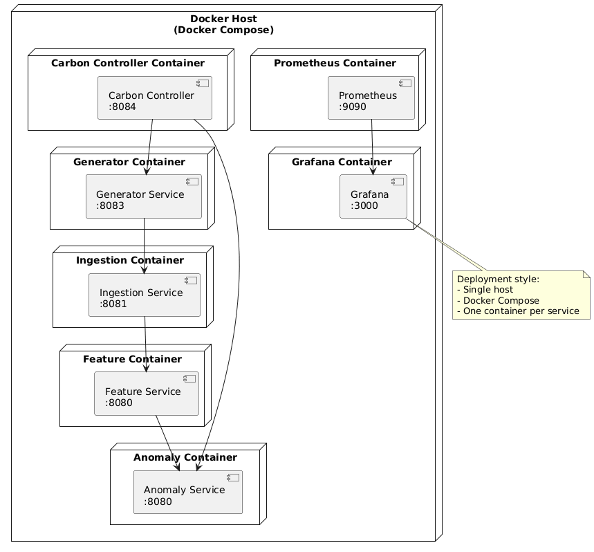
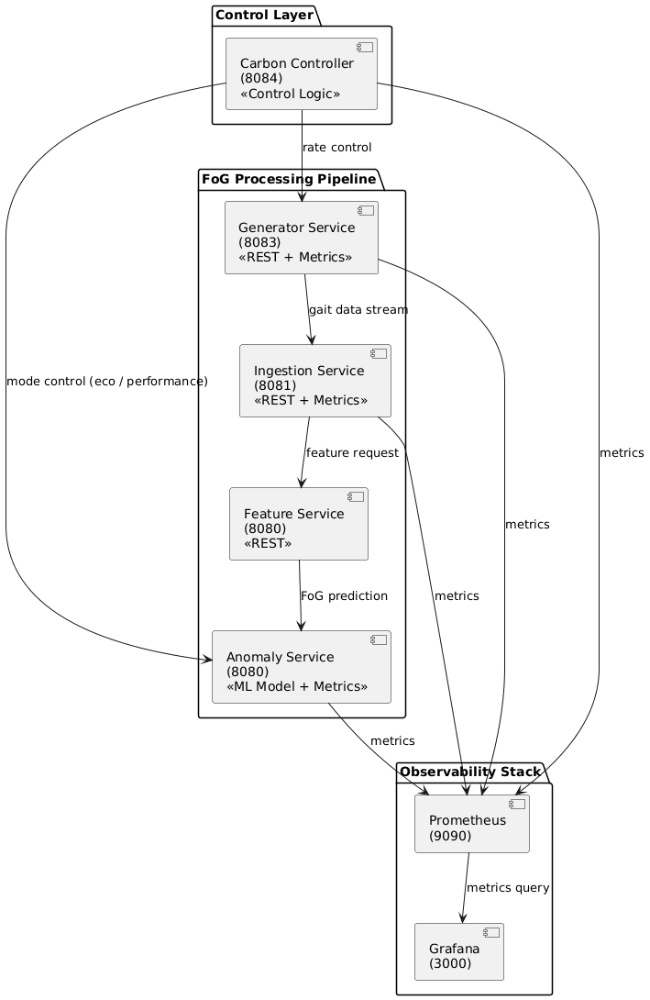
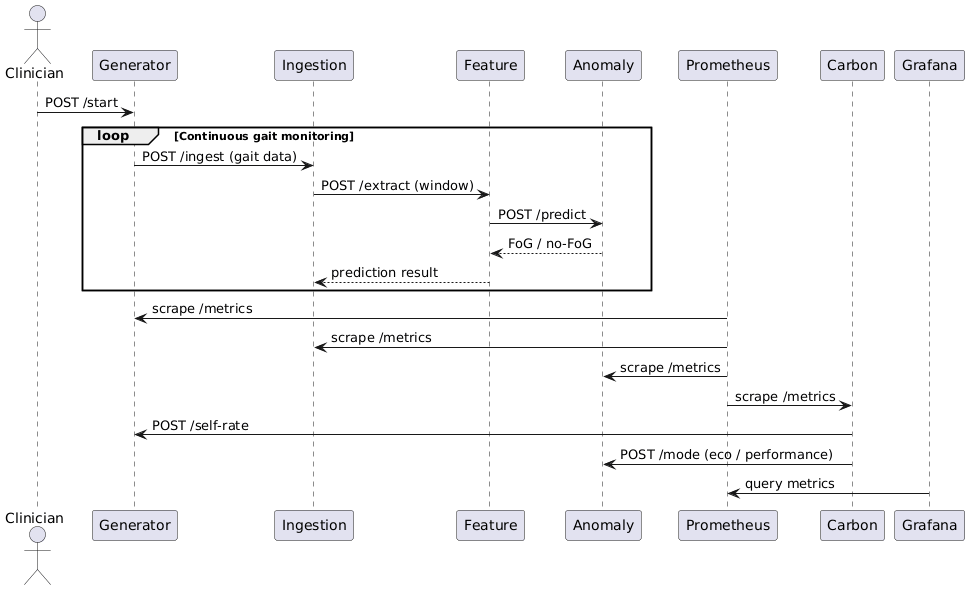
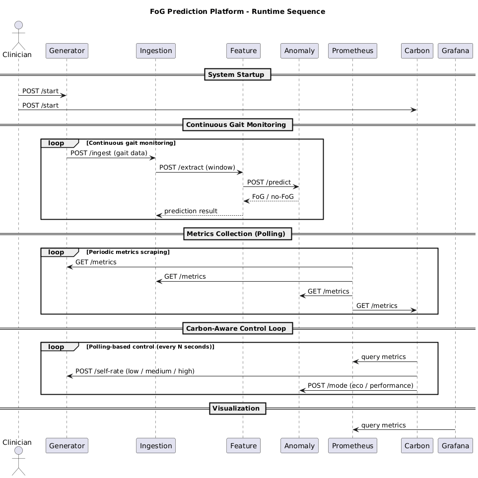

# FoG Prediction Platform – Architecture Documentation

This document describes the architecture of the **Freezing of Gait (FoG) Prediction Platform**.  
The system is implemented using a **microservice architecture**, deployed via **Docker Compose**, and enhanced with **carbon-aware control** and **observability**.

The platform continuously generates gait sensor data, processes it through a feature extraction and machine learning pipeline, detects FoG events, and dynamically adapts system behavior to reduce energy consumption while maintaining diagnostic accuracy.

---

## Overview

The platform consists of the following major subsystems:

- **Data Generation and Processing Pipeline**
- **Machine Learning–based FoG Detection**
- **Carbon-Aware Control Layer**
- **Observability Stack (Prometheus & Grafana)**

The system architecture is documented using four UML diagrams:
- Use Case Diagram
- Component Diagram
- Sequence Diagram
- Deployment Diagram

---

## Deployment Diagram

The deployment diagram shows **where each service runs** and **how the system is deployed** using Docker Compose on a single host.

### Explanation
- All services run on a **single Docker host**
- Each microservice is deployed as **one container per service**
- Services communicate using Docker’s internal networking
- Selected ports are exposed for APIs and dashboards

### Deployed Services
- **Carbon Controller (8084)** – Controls data rate and inference mode
- **Generator Service (8083)** – Generates gait sensor data
- **Ingestion Service (8081)** – Buffers incoming sensor data
- **Feature Service (8082)** – Extracts and normalizes gait features
- **Anomaly Service (8080)** – Performs FoG prediction
- **Prometheus (9090)** – Collects metrics
- **Grafana (3000)** – Visualizes metrics

---

## Component Diagram

The component diagram illustrates the **logical structure of the system** and how services interact.

### Explanation
- **FoG Processing Pipeline**
  - Generator → Ingestion → Feature → Anomaly
- **Control Layer**
  - Carbon Controller dynamically adjusts system behavior
- **Observability Stack**
  - Prometheus scrapes metrics
  - Grafana visualizes metrics

### Key Benefits
- Clear separation of concerns
- Explicit control feedback loop
- Observability decoupled from core processing logic

---

## Sequence Diagram

The sequence diagram describes **runtime behavior during continuous gait monitoring**.

### Runtime Flow
1. Clinician starts data collection  
2. Generator streams gait sensor data  
3. Ingestion buffers incoming samples  
4. Feature Service extracts gait features  
5. Anomaly Service predicts FoG / no-FoG  
6. Prometheus periodically scrapes system metrics  
7. Carbon Controller **polls metrics at regular intervals** and adjusts:
   - data generation rate  
   - inference mode (eco / performance)  
8. Grafana queries metrics for visualization  

### Characteristics
- Continuous monitoring loop  
- REST-based microservice communication  
- **Polling-based carbon-aware feedback control**  
- Pull-based observability using Prometheus  

---

## Use Case Diagram

The use case diagram captures **system functionality from a user and system perspective**.

### Actors
- **Clinician** – Operates and supervises the system
- **Prometheus** – Collects metrics
- **Grafana** – Visualizes metrics

### Main Use Cases
- **UC1: Start Data Collection**
- **UC2: Detect FoG Events**
- **UC3: Expose System Metrics**
- **UC4: Adjust Data Generation Rate**
- **UC5: Optimize Energy Usage**
- **NS1: Visualize Metrics**

### Architectural Insights
- Defines the need for generator and ingestion services
- Requires ML-based anomaly detection
- Introduces a carbon-aware feedback loop
- Relies on Prometheus instrumentation

---

## Design Rationale

- **Microservices** improve modularity and maintainability
- **REST APIs** provide loose coupling between services
- **Docker Compose** enables reproducible deployment
- **Prometheus and Grafana** provide observability
- **Carbon-aware control** enables sustainability-oriented system adaptation

---

## Summary

The four UML diagrams together provide a **complete architectural view** of the FoG Prediction Platform:

| Diagram | Purpose |
|------|--------|
| Use Case | What the system does and why |
| Component | How the system is structured |
| Sequence | How the system behaves at runtime |
| Deployment | Where the system runs |

